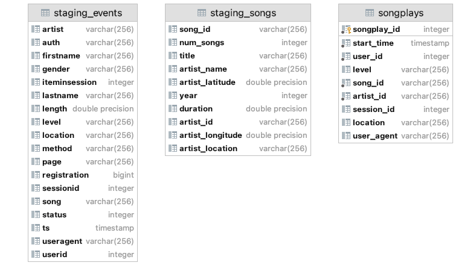
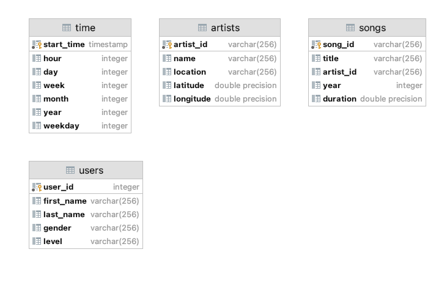

# DW

This project consists 
- sql_queries.py : which is used for hold all needed queries for table creation - copy data - insert data 
- create_tables.py : which is used for tables creation
- etl.py which used to load and processing data 

## Project Summary

A music streaming startup, Sparkify, has grown their user base and song database and want to move their processes and data onto the cloud. Their data resides in S3, in a directory of JSON logs on user activity on the app, as well as a directory with JSON metadata on the songs in their app.

As their data engineer, you are tasked with building an ETL pipeline that extracts their data from S3, stages them in Redshift, and transforms data into a set of dimensional tables for their analytics team to continue finding insights in what songs their users are listening to. You'll be able to test your database and ETL pipeline by running queries given to you by the analytics team from Sparkify and compare your results with their expected results.

## Database Schema

### Satging Tables

- staging_songs
- staging_events

### Fact Table

- songplays 
records in event data associated with song plays i.e. records with page NextSong
songplay_id, start_time, user_id, level, song_id, artist_id, session_id, location, user_agent

### Dimension Tables
- users 
users in the app
user_id, first_name, last_name, gender, level
- songs 
songs in music database
song_id, title, artist_id, year, duration
- artists
artists in music database
artist_id, name, location, lattitude, longitude
- time 
timestamps of records in songplays broken down into specific units
start_time, hour, day, week, month, year, weekday

## Star Schema: 
There is one main fact table containing all the measures associated with each event *songplays*, 
and 4-dimensional tables *songs*, *artists*, *users* and *time*, each with a primary key that is being referenced from the fact table.

## How to Use

1. Run create_tables.py from terminal to set up the database and tables.
2. Run etl.py from terminal to process and load data into the database.

